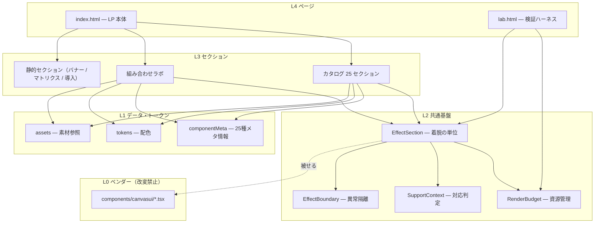
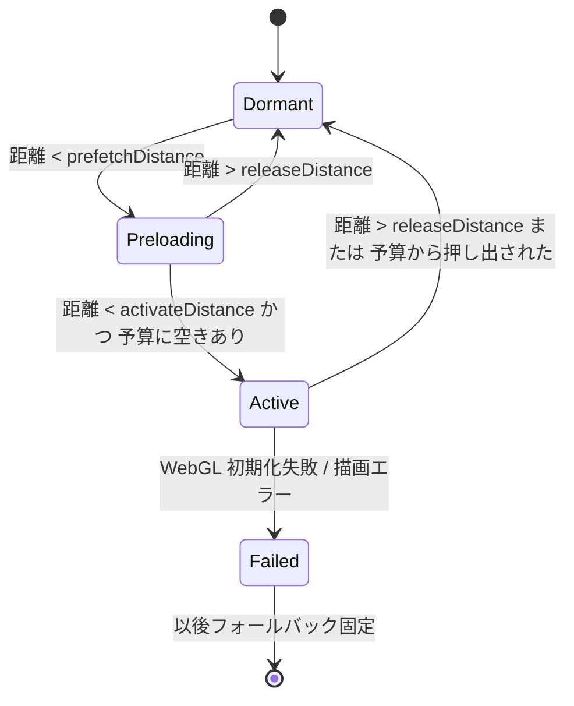
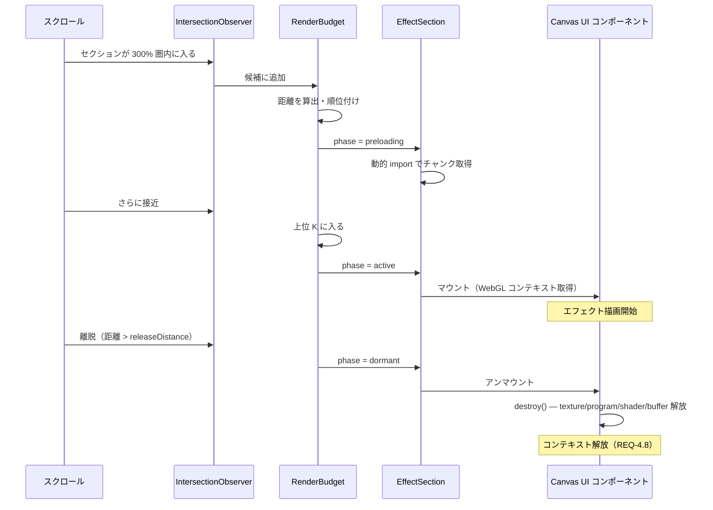
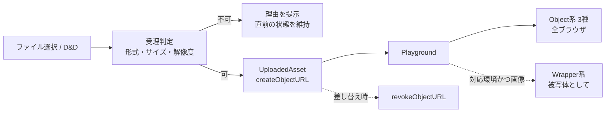

# 設計詳細書 — Canvas UI 全機能 LP

| | |
|---|---|
| 文書種別 | 設計詳細（SDD フェーズ 2 / 3） |
| バージョン | 1.1 |
| 作成日 | 2026-07-25 |
| 状態 | レビュー待ち |
| 前工程 | [requirements.md](requirements.md) |
| 補遺 | [ui-design.md](ui-design.md)（ビジュアル） / [module-spec.md](module-spec.md)（実装詳細） |
| 次工程 | `tasks.md`（実装タスク分解） |

**この文書は「どう作るか」を定義する。** すべての設計判断は `requirements.md` の要件に紐づく。
コードは**型定義と契約（インターフェース）まで**を示し、実装本体は `tasks.md` 以降で扱う。

---

## 1. 設計目標

要件から導かれる、本設計が満たすべき性質。

| # | 目標 | 由来 |
|---|---|---|
| G-1 | **WebGL コンテキスト数を常に上限以下に保つ**。破綻しないことが最優先 | REQ-4 / §6.1 |
| G-2 | エフェクトの有無にかかわらず**同じ内容・同じレイアウト**を表示する | REQ-5.1 / NFR-1.4 |
| G-3 | 25 セクションを**単一の共通構造**で実装する。個別実装を作らない | NFR-3.1 / REQ-4.9 |
| G-4 | Canvas UI のソースを**一切改変しない** | NFR-3.2 |
| G-5 | 検証（T-1〜T-9）で確定する値を**設定値として外出し**し、実装を変えずに反映できる | REQ-10 |
| G-6 | 素材の差し替えでセクション実装を変更しない | REQ-7.2 |

### 1.1 設計の中心となる着想

> **「エフェクトはコンテンツの装飾であり、コンテンツの容器ではない」**

Canvas UI の Wrapper 系は `children` を包む形をとるため、素朴に書くと
「エフェクトがコンテンツを所有する」構造になる。この形だとエフェクトを外した瞬間に
コンテンツも消え、フォールバックのために別実装が必要になる（G-2 / G-3 に反する）。

そこで本設計では**所有関係を反転**させる。
コンテンツは常にセクションが所有し、**エフェクトは着脱可能なラッパーとして後から被せる**。

```
✗ 素朴な構造            ○ 本設計
  <Glass>                 <EffectSection effect={Glass}>
    <Content/>              <Content/>          ← 常に存在
  </Glass>                </EffectSection>      ← Glass は着脱される
```

この反転により、**G-1 / G-2 / G-3 が同時に満たされる**。
アンマウントすればコンテキストが解放され（G-1）、コンテンツはそのまま残り（G-2）、
25 セクションが同じ書き方になる（G-3）。**本設計の他のほぼすべてがここから導かれる。**

---

## 2. アーキテクチャ

### 2.1 レイヤー構成



**依存の向きは常に下向き。** L0 は誰にも依存せず、誰も L0 を改変しない（G-4）。

### 2.2 ディレクトリ構成

```
app/
├─ index.html                  LP 本体（Origin Trial meta）
├─ lab.html                    検証ハーネス（第 2 エントリ）
├─ vite.config.ts              multi-page 設定を追加
└─ src/
   ├─ main.tsx                 LP エントリ
   ├─ lab.tsx                  検証エントリ
   ├─ components/
   │  └─ canvasui/             ★ L0 ベンダー。改変禁止
   ├─ core/                    ★ L2 共通基盤
   │  ├─ RenderBudget.tsx        資源管理（Provider + hook）
   │  ├─ EffectSection.tsx       着脱の単位
   │  ├─ EffectBoundary.tsx      エラー境界
   │  ├─ SupportContext.tsx      html-in-canvas 対応判定
   │  ├─ effectRegistry.ts       slug → コンポーネント の遅延解決
   │  └─ DebugHud.tsx            計測用 HUD
   ├─ data/
   │  ├─ components.generated.ts ★ 自動生成。25種メタ情報
   │  ├─ categories.ts           カテゴリ定義と相性マトリクス
   │  ├─ combos.ts               組み合わせプリセット
   │  └─ assets.ts               素材参照の単一定義
   ├─ styles/
   │  ├─ tokens.ts               配色トークン + rgb01 変換
   │  └─ globals.css
   ├─ sections/                  L3
   │  ├─ Hero.tsx / SupportBanner.tsx / HowItWorks.tsx
   │  ├─ Catalog.tsx             25 セクションを meta から生成
   │  ├─ CombinationLab.tsx
   │  ├─ CompatibilityMatrix.tsx / Constraints.tsx
   │  └─ Install.tsx / Footer.tsx
   └─ lab/                       検証ハーネス（T-1〜T-9）
      ├─ ContextBudgetProbe.tsx    T-6
      ├─ NestingProbe.tsx          T-2 / T-3 / T-4
      └─ MatrixProbe.tsx           T-5 / T-7
```

`scripts/generate-component-meta.ts` が `data/registry.json` + `data/options.json` から
`components.generated.ts` を生成する（NFR-3.3）。

---

## 3. 設計判断（ADR）

### ADR-1: エフェクトの着脱を「条件付きレンダリング」で行う
- **決定**: 対象コンポーネントを条件付きでレンダリングし、非活性時は素の `<div>` に差し替える
- **理由**: WebGL コンテキストを解放する手段は**アンマウントしかない**（§6.1）。
  `IntersectionObserver` による内蔵の停止は rAF を止めるだけで解放しない
- **代替案**: 内蔵の停止に任せる → **却下**。予算が減らず REQ-4 を満たせない
- **帰結**: React の再マウントが発生するため、`children` の状態は保持されない
  → セクションのコンテンツは**ステートレス**に保つ（設計制約）

### ADR-2: ステージに明示的な寸法を与える
- **決定**: 各効果セクションは**固定寸法のステージ**を持ち、その内側にコンテンツを収める
- **理由**: Canvas UI の Wrapper は内部で `width:100%; height:100%; overflow:auto` の
  コンテンツ div を作る。**親に高さが無いと解決できない**。
  また固定寸法なら着脱時にレイアウトシフトが起きない（NFR-1.4 / CLS 0.1 未満）
- **帰結**: ステージ寸法は `EffectSection` が管理し、活性・非活性で同一の box を維持する

### ADR-3: ルーターを導入せず、Vite の multi-page 構成にする
- **決定**: `index.html`（LP）と `lab.html`（検証）の 2 エントリ
- **理由**: 検証ハーネスは LP と**同時に読み込まれてはならない**（コンテキストを食う）。
  ルーター依存を増やさずに完全分離できる
- **代替案**: React Router → **却下**。単一 LP に対して過剰

### ADR-4: エフェクトコンポーネントを動的 import で遅延解決する
- **決定**: `effectRegistry` が `slug → () => import(...)` を持ち、活性化時に解決する
- **理由**: 25 個すべてを初期バンドルに含めると LCP 2.5 秒（NFR-1.2）を満たせない。
  Object 系 3 種は `three` を引き込むため特に重い
- **帰結**: 初回活性時に一瞬の遅延が生じる → **プリフェッチ距離を予算距離より広く**とる

### ADR-5: メタ情報を自動生成する
- **決定**: `components.generated.ts` をレジストリから生成し、手書きしない
- **理由**: 25 種 × 409 オプション。手書きは必ず実態と乖離する（NFR-3.3）
- **帰結**: 生成物はコミットする（ビルド時にネットワークへ依存しない）

### ADR-6: 配色はダーク固定
- **決定**: `prefers-color-scheme` に追従しない
- **理由**: REQ-9.3。追従型 4 種（`Asciify`/`Cloth`/`Clouds`/`Peel`）の両テーマ検証コストを削減
- **帰結**: `tokens.ts` が単一の真実。`"auto"` 指定は使わない（REQ-9.4）

---

## 4. 中核設計 — RenderBudget（REQ-4）

**本 LP でもっとも重要な機構。** これが正しく動けば AC-1〜3 が通り、誤れば LP が破綻する。

### 4.1 責務
1. 効果セクションの登録・解除を受け付ける
2. 各セクションのビューポートからの距離を把握する
3. **距離が近い順に上限 K 個までを「活性」と判定**する
4. 活性・非活性の変化を各セクションへ通知する

### 4.2 状態モデル

各セクションは 3 状態をとる。



| 状態 | エフェクト | WebGL コンテキスト | 表示 |
|---|---|---|---|
| `Dormant` | 未マウント | **なし** | 素の HTML |
| `Preloading` | チャンクのみ取得 | なし | 素の HTML |
| `Active` | マウント済み | **1 個消費** | エフェクト適用 |
| `Failed` | 破棄 | なし | 素の HTML |

### 4.3 ヒステリシス

活性化と解放に**別の閾値**を設ける。これがないと境界上でマウント／アンマウントが振動する。

```
releaseDistance (2.0vh) ─────────┐  ← ここを超えたら解放
                                 │
activateDistance (1.0vh) ────┐   │  ← ここを下回ったら活性化候補
                             │   │
        ┌────────────────────┴───┴────┐
        │        ビューポート          │
        └──────────────────────────────┘
```

距離の単位は**ビューポート高さ**。`prefetchDistance`(3.0) > `releaseDistance`(2.0) > `activateDistance`(1.0)。

### 4.4 インターフェース

```ts
/** 検証 T-6 の結果で確定する設定値（G-5） */
export interface BudgetConfig {
  /** 同時活性上限。REQ-4.2 初期値 8。T-6 で確定 */
  capacity: number;
  /** モバイル時の上限。NFR-2.4 */
  capacityMobile: number;
  /** 活性化閾値（ビューポート高さ単位） */
  activateDistance: number;
  /** 解放閾値。activateDistance より大きいこと（ヒステリシス） */
  releaseDistance: number;
  /** チャンク先読み閾値。releaseDistance より大きいこと */
  prefetchDistance: number;
}

export type SectionPhase = "dormant" | "preloading" | "active" | "failed";

export interface BudgetSnapshot {
  capacity: number;
  activeCount: number;
  phases: ReadonlyMap<string, SectionPhase>;
}

export interface RenderBudgetApi {
  /** セクションの登録。戻り値は解除関数 */
  register(id: string, element: Element, weight?: number): () => void;
  /** 当該セクションの現在フェーズを購読する */
  usePhase(id: string): SectionPhase;
  /** 失敗を報告し、以後 active に選ばれないようにする（REQ-4.7） */
  reportFailure(id: string): void;
  /** 計測用スナップショット（DebugHud / 受入 AC-3） */
  useSnapshot(): BudgetSnapshot;
}
```

### 4.5 距離の測定方法

25 セクション全てを毎スクロール計測するのは無駄。**2 段構え**にする。

1. **粗い絞り込み** — `IntersectionObserver` を `rootMargin: "300% 0px"` で 1 つだけ用意し、
   全セクションを監視する。交差しているものだけを「候補」とする
2. **順位付け** — 候補が `capacity` を超えるときだけ、候補に対して
   `getBoundingClientRect()` を実行し、**ビューポート中心からの距離**で昇順に並べて上位 K を選ぶ

順位付けは `requestAnimationFrame` で間引き、1 フレームに 1 回までとする。
候補数が `capacity` 以下のときは順位付け自体を省略する（通常時のコストはほぼゼロ）。

### 4.6 選定アルゴリズム

```
1. candidates ← IO が交差を報告しているセクション
2. 各 candidate の distance ← |rect.center.y - viewport.center.y| / viewport.height
3. candidates から phase === "failed" を除外
4. distance 昇順にソート
5. 上位 capacity 個 かつ distance < activateDistance のものを nextActive とする
6. 現在 active かつ nextActive に無く distance > releaseDistance のものを解放
   （distance <= releaseDistance のものはヒステリシス域なので維持する）
7. distance < prefetchDistance のものにチャンク先読みを指示する
```

**ステップ 6 の但し書きが重要。** 予算に空きがあるうちはヒステリシス域のものを維持し、
**空きが無い場合に限り、最も遠いものから押し出す**。これにより振動を防ぎつつ上限を守る。

### 4.7 マウント／アンマウントの流れ



---

## 5. EffectSection（REQ-4.9 / G-2 / G-3）

25 セクションすべてがこの 1 コンポーネントで実装される。

### 5.1 契約

```ts
export interface EffectSectionProps {
  /** 一意な識別子。RenderBudget の登録キー */
  id: string;
  /** 適用するエフェクトの slug。effectRegistry が解決する */
  effect: ComponentSlug;
  /** エフェクトへ渡すオプション。色は必ず rgb01 済みの値 */
  effectProps?: Record<string, unknown>;
  /** ステージ寸法。ADR-2 により明示必須 */
  stage?: { minHeight?: string; aspect?: number };
  /** エフェクトを常に無効にする（静的セクション用） */
  disabled?: boolean;
  children: React.ReactNode;
}
```

### 5.2 レンダリング規則

```
phase === "active" かつ 対応環境 かつ !disabled
  → <Effect {...effectProps}><Stage>{children}</Stage></Effect>
それ以外
  → <Stage>{children}</Stage>
```

**`<Stage>` は両分岐で同一。** これにより:
- レイアウトが変化しない（NFR-1.4）
- フォールバックが自動的に成立する（REQ-5.1）
- 非対応環境では常に下の分岐になる（REQ-5.1 / 5.7 は Object 系のため例外扱い）

### 5.3 Object 系の扱い

Object 系 3 種は `children` を取らず、非対応環境でも動作する（REQ-5.7）。
そのため分岐条件が異なる。

```
family === "object"
  → 対応判定を参照しない。phase === "active" のみで判定
  → children はエフェクトの外側（説明文）として並置する
```

`EffectSection` は `componentMeta[slug].family` を見てこの差を吸収する。
**呼び出し側は 22 種と 3 種を区別しなくてよい。**

---

## 6. 対応判定とフォールバック（REQ-5）

### 6.1 判定

Canvas UI 各コンポーネントと**同一の判定式**を用いる（挙動を一致させるため）。

```ts
export function detectHtmlInCanvas(): boolean {
  if (typeof document === "undefined") return false;
  const probe = document.createElement("canvas");
  const ctx = probe.getContext("2d");
  return Boolean(
    ctx &&
    typeof (ctx as ElementImageContext).drawElementImage === "function" &&
    typeof (probe as PaintableCanvas).requestPaint === "function",
  );
}
```

判定はアプリ起動時に **1 回だけ**実行し、`SupportContext` で配布する。
Origin Trial トークンの有無・失効はこの判定に自然に反映される（REQ-5.9）。

### 6.2 告知バナー

| 項目 | 設計 |
|---|---|
| 表示条件 | `!supported`（REQ-5.3 / 5.6） |
| 配置 | ページ最上部の通常フロー。**`position: fixed` にしない**（REQ-5.5 コンテンツを覆わない） |
| 閉じる | `sessionStorage` にフラグを保存（REQ-5.4） |
| 文言 | 「Chrome で開くと 22 種のエフェクトが動作します。現在は内容のみ表示しています」＋ 有効化手順へのリンク |

### 6.3 異常隔離（REQ-4.7 / 7.3）

`EffectBoundary` は React のエラー境界。エフェクト部分のみを包む。

```
エフェクトが例外を投げる
  → EffectBoundary が捕捉
  → RenderBudget.reportFailure(id)   ← 以後 active に選ばれない
  → 同じ children を素の Stage で再描画
  → 他セクションは影響を受けない
```

WebGL コンテキスト生成失敗は例外を投げない場合があるため、
`EffectSection` はマウント後に**描画が始まったかを確認**し、一定時間内に始まらなければ
`reportFailure` を呼ぶ。

---

## 7. データ設計

### 7.1 コンポーネントメタ情報（NFR-3.3）

```ts
export type ComponentFamily = "wrapper" | "object";

/** 相互作用の型。組み合わせ相性の判定に使う（REQ-3.1） */
export type InteractionKind =
  | "ambient"   // ポインタ非依存。積み重ねに安全
  | "lens"      // カーソル追従の局所効果。同種は競合
  | "field"     // 撹乱場。全面効果
  | "geometry"  // ジオメトリ変形。同種は競合
  | "scroll";   // スクロール占有。同種は併用不可

export interface ComponentMeta {
  slug: string;                    // "glass"
  name: string;                    // "Glass"
  family: ComponentFamily;
  interaction: InteractionKind;
  description: string;
  optionCount: number;
  requiresThree: boolean;
  requiresAsset: boolean;          // Object 系 = true
  acceptsChildren: boolean;
  installCommand: string;
  docsUrl: string;
}

export const componentMeta: Record<string, ComponentMeta>;
export const componentOrder: readonly string[];  // カタログの並び順（REQ-1.7）
```

`interaction` は `docs/03-combination-research.md` §3 の分類を機械可読にしたもの。
**相性マトリクス（REQ-3）と組み合わせプリセットの検証に使う。**

### 7.2 相性マトリクス（REQ-3）

```ts
export type Rating = "recommended" | "ok" | "caution" | "avoid";  // ◎ ○ △ ✕

export interface CompatibilityCell {
  rating: Rating;
  /** 根拠。REQ-3.2 で必須。REQ-3.3 により検証結果に基づくこと */
  rationale: string;
  /** 根拠となった検証 ID（T-2 等）。未検証なら null */
  verifiedBy: string | null;
}

export const compatibilityMatrix:
  Record<InteractionKind, Record<InteractionKind, CompatibilityCell>>;
```

**`verifiedBy: null` のセルは UI 上で「未検証」と明示する。** 推測を実測と混ぜない（REQ-3.3）。

### 7.3 組み合わせプリセット（REQ-2）

```ts
export interface ComboPreset {
  id: string;
  title: string;
  /** 外側から内側の順。長さ 1〜2（REQ-2.7） */
  layers: Array<{ slug: string; props: Record<string, unknown> }>;
  /** 意図の説明 */
  intent: string;
  /** "showcase" = 推奨例 / "antipattern" = 避けるべき例（REQ-2.6） */
  kind: "showcase" | "antipattern";
  /** T-3 の結果に依存する場合に指定（REQ-2.8） */
  gatedBy?: string;
}
```

`gatedBy` が設定されたプリセットは、対応する検証が成立するまで**表示されない**。
これにより REQ-2.8 の条件付き要件をデータで表現できる。

### 7.4 素材参照（REQ-7.2 / G-6）

```ts
export interface AssetRef {
  src: string;
  /** 読み込み失敗時の代替表示に使う説明 */
  label: string;
}

export const assets = {
  glassObject:    { src: "/svg/logo-outlined.svg", label: "ロゴ" },
  particleObject: { src: "/images/character-sm.png", label: "キャラクター" },
  ditheredObject: { src: "/models/form.glb", label: "3D モデル" },
  lensSubject:    { src: "/images/spec-sheet.png", label: "設定資料" },
} as const satisfies Record<string, AssetRef>;
```

**素材の差し替えはこのファイルのみで完結する。** セクション実装はパスを直接持たない。

### 7.5 配色トークン（REQ-9）

```ts
export const tokens = {
  bg:      "#0B0B0D",
  surface: "#141417",
  fg:      "#F5F5F4",
  muted:   "#8A8A93",
  accent:  "#066AFF",
} as const;

/** Wrapper 系が要求する [r,g,b] 0〜1 形式へ変換する（REQ-9.2 / §6.3） */
export function rgb01(hex: string): [number, number, number];
```

CSS 側は同じ値を custom property として持ち、**TS とのずれを防ぐため tokens.ts から生成**する。

---

## 8. セクション設計

### 8.1 カタログ（REQ-1）

`componentOrder` を `map` して生成する。**セクションごとの個別コンポーネントを作らない**（G-3）。

```ts
interface CatalogEntry {
  slug: string;
  /** そのエフェクトの特徴が判別できる被写体（REQ-1.5） */
  subject: SubjectKind;
  effectProps: Record<string, unknown>;
  stage: { minHeight?: string; aspect?: number };
}

/** 被写体の型。docs/06 のモチーフ指針に対応 */
type SubjectKind =
  | "dense-document"  // 情報密度の高い版面 → レンズ系
  | "bold-heading"    // 太い見出し → 破壊系
  | "color-artwork"   // 彩度の高いイラスト → 流体系・ジオメトリ系
  | "ui-mock"         // UI モック → パーティクル系
  | "object-stage";   // Object 系
```

`subject` からコンテンツコンポーネントを解決する。**被写体は 5 種類のみ**なので、
25 セクション分のコンテンツを個別に作る必要がない。

**並び順の制約**（REQ-1.7 同一カテゴリ 3 連続禁止、REQ-1.6 スクロール駆動型の分離）は
`componentOrder` の生成時に検証し、違反していればビルドを失敗させる。

### 8.2 組み合わせラボ（REQ-2）【T-2 不成立を受けて改訂】

**検証 T-2 により、Wrapper どうしの入れ子は成立しないことが判明した**（docs/03 §7.1）。
内側ラッパーの WebGL 出力は外側の `drawElementImage` に黒として取り込まれる。
REQ-10.6 に従い REQ-2.3 を「並置による提示」に読み替え、構成を次のとおり改める。

| サブ | 対応要件 | 内容 |
|---|---|---|
| **A. パラメータ融合** | REQ-2.1 / 2.2 | `Glass` 1 つ + スライダー。**重ねずに複合表現を作る**主役に格上げ |
| **B. Object × Wrapper** | REQ-2.8 | **T-3 で成立が実証された唯一の重ね合わせ。** LP の目玉 |
| **C. 並置** | REQ-2.3（読み替え後） | 同一コンテンツに別々の効果をかけて横に並べる |
| **D. 入れ子は成立しない** | REQ-2.6 | **実証結果そのものを見せる。** 研究がテーマの LP における正当なコンテンツ |

#### 変更の要点
- **サブ B が新しい主役。** three.js の canvas は `layoutsubtree` の入れ子キャプチャを伴わないため、
  外側の Wrapper から普通の canvas として取り込まれる
- **サブ D は「避けるべき例」から「実証された限界」へ格上げ。**
  推測ではなく実測にもとづく提示になる（REQ-3.3 の精神に合致）
- 入れ子の深さ制限（REQ-2.7）は意味を失った。**入れ子は使わない**

#### 予算の扱い
- サブ A: コンテキスト 1 個
- サブ B: 2 個（外側 Wrapper + 内側 Object）
- サブ C: 2 個（並置する 2 つ）
- サブ D: 2 個（不成立の実演にも実物が要る）

いずれも同時に 1 サブのみ表示し、切り替え時は **2 フレームに分けて**前をアンマウントする（N-5）。

### 8.3 静的セクション

バナー・相性マトリクス・制約説明・導入案内・Footer は `disabled` の `EffectSection`、
またはエフェクトを持たない通常のセクションとして実装する。
**これらは意図的にエフェクトを持たない**（`docs/05` の方針。予算に余裕を作る）。

導入案内のコピーボタン（REQ-8.6）は `navigator.clipboard.writeText` を用い、
失敗時は `execCommand` にフォールバックせず、**選択可能なテキストとして表示**する。

---

## 9. 検証ハーネス（REQ-10）

`lab.html` は LP と完全に分離した第 2 エントリ（ADR-3）。

| 画面 | 検証 | 設計 |
|---|---|---|
| `ContextBudgetProbe` | **T-6** | WebGL2 コンテキストを 1 つずつ生成し、失敗または既存コンテキストのロストを検出するまで増やす。**実測上限を表示**し `BudgetConfig.capacity` の根拠とする |
| `NestingProbe` | T-2 / T-3 / T-4 | 外側・内側のコンポーネントをプルダウンで選び、入れ子段数を 1〜3 で切り替える。fps を常時表示 |
| `MatrixProbe` | T-5 / T-7 | `"auto"` 指定と RGB 明示指定を並べて比較。マウント／アンマウントを反復し復帰を確認 |

### 9.1 T-6 の測定方法

```
1. 空の canvas を生成し getContext("webgl2") を試行
2. 成功したら配列に保持し、既存の全コンテキストが生きているか確認
   （webglcontextlost の発火、または gl.isContextLost() を監視）
3. 失敗するか、既存コンテキストが失われた時点の個数を記録
4. これを実測上限とし、安全マージンを引いた値を capacity とする
```

**実測値そのものを capacity にしない。** 本 LP は WebGL 以外にもコンテキストを使う可能性があり、
またブラウザ・GPU により変動するため、**実測値の 50〜60% 程度**を採用する。

### 9.2 DebugHud

LP 側にも組み込む（クエリパラメータ `?debug=1` で有効）。

表示項目: 活性セクション数 / 上限 / 各セクションのフェーズ / 概算 fps。
**AC-3（コンテキスト数の監視）の検証手段**を兼ねる。

---

## 10. 性能設計（NFR-1）

| 要件 | 設計上の対応 |
|---|---|
| NFR-1.1 50fps 以上 | 同時活性を予算内に抑える。入れ子は 2 段まで。`DebugHud` で常時確認 |
| NFR-1.2 LCP 2.5 秒 | エフェクトは全て動的 import（ADR-4）。ヒーローの Object 系のみ優先読み込み |
| NFR-1.3 アセット遅延 | `assets` は `EffectSection` が active になってから読み込む。初期バンドルに含めない |
| NFR-1.4 CLS 0.1 未満 | `<Stage>` の固定寸法（ADR-2）。着脱で box が変化しない |
| NFR-1.5 メモリ単調増加なし | `destroy()` を確実に呼ぶ（REQ-4.8）。T-7 で往復を検証 |

### 10.1 モバイル（NFR-2.3 / 2.4）

`capacityMobile` を別に持ち、画面幅と `navigator.hardwareConcurrency` で選択する。
初期値は **3**。モバイルでは入れ子実演を無効化し、**単体デモのみ**とする。
これは機能削減ではなく、NFR-2.3「内容が読めること」を満たすための設計判断。

---

## 11. アクセシビリティ設計（REQ-6）

| 要件 | 設計 |
|---|---|
| 6.1 / 6.2 reduced-motion | Canvas UI 側が 25/25 で対応済み。**加えて**本設計では、reduced-motion 時に `capacity` を下げエフェクト数自体を減らす |
| 6.3 実テキスト | `<Stage>` の中身は常に通常の DOM。canvas への描画のみでテキストを提供しない |
| 6.4 支援技術から隠す | Canvas UI の出力キャンバスが `aria-hidden` + `pointer-events:none`。**追加対応不要**（確認済み） |
| 6.5 キーボード操作 | エフェクトはイベントを奪わない（`pointer-events:none`）。通常のフォーカス順が保たれる |
| 6.6 コントラスト AA | `tokens.ts` の組み合わせを設計時に検証。**エフェクト非適用状態で判定** |
| 6.7 破壊系は 1 段まで | `combos.ts` のプリセット定義時に制約。`interaction` から機械的に検証可能 |
| 6.8 alt 属性 | 被写体コンポーネントが必ず `alt` を要求する型にする |

---

## 12. エラー処理方針

| 事象 | 検出 | 対応 | 影響範囲 |
|---|---|---|---|
| エフェクトが例外を投げる | `EffectBoundary` | 素の Stage で再描画 + `reportFailure` | 当該セクションのみ |
| WebGL コンテキスト生成失敗 | マウント後の描画開始タイムアウト | 同上 | 当該セクションのみ |
| コンテキストロスト | Canvas UI 側にハンドラなし | **予算管理で未然に防ぐのが唯一の対策** | — |
| アセット読み込み失敗 | Object 系の `onError` | 代替表示（REQ-7.3） | 当該セクションのみ |
| アセット読み込み中 | Object 系の `onLoad` 未達 | 読み込み中表示（REQ-7.4） | — |
| html-in-canvas 非対応 | `detectHtmlInCanvas()` | 全セクションフォールバック + バナー | 全体（正常系） |

**方針: 1 セクションの失敗が他へ波及しないこと。** これは REQ-4.7 の明示要件でもある。

---

## 13. テスト戦略

| 層 | 対象 | 手段 |
|---|---|---|
| 単体 | `rgb01` / 選定アルゴリズム / 並び順制約 | Vitest。**選定アルゴリズムは純関数として切り出しテスト可能にする** |
| 結合 | マウント／アンマウントの往復、予算上限 | `lab.html` の手動検証（T-6 / T-7） |
| 受入 | AC-1〜10 | 手動。AC-3 は `DebugHud` で確認 |
| 静的 | 型・並び順・プリセット制約 | `tsc --strict` + ビルド時検証スクリプト |

**選定アルゴリズム（§4.6）を純関数に切り出す**のは設計上の要請。
`(candidates, config) => nextPhases` の形にすれば、DOM なしで境界条件を網羅できる。

---

## 14. 要件トレーサビリティ

| 要件 | 実現する設計要素 |
|---|---|
| REQ-1 カタログ | §8.1 `Catalog` + `componentMeta` + `SubjectKind` |
| REQ-2 組み合わせラボ | §8.2 + `combos.ts`（`gatedBy` で 2.8 を表現） |
| REQ-3 相性マトリクス | §7.2 `compatibilityMatrix`（`verifiedBy` で 3.3 を担保） |
| **REQ-4 資源管理** | **§4 RenderBudget 全体 + §5 EffectSection** |
| REQ-5 フォールバック | §6 `SupportContext` + `EffectBoundary` + §5.2 の分岐規則 |
| REQ-6 アクセシビリティ | §11 |
| REQ-7 アセット | §7.4 `assets` + §12 のエラー処理 |
| REQ-8 導入案内 | §8.3 |
| REQ-9 トークン | §7.5 `tokens.ts` + `rgb01` |
| REQ-10 検証ハーネス | §9 `lab.html` |
| NFR-1 性能 | §10 |
| NFR-2 互換性 | §6 + §10.1 |
| NFR-3 保守性 | §2.2 構成 + ADR-5 生成 + §8.1 共通化 |
| NFR-4 セキュリティ | 静的サイト。§7.4 は同一オリジン参照のみ |
| NFR-5 SEO | §5.2 により本文は常に DOM 上に存在 |
| **REQ-11 アップロード（M4）** | **§15**。MVP で必要な準備は §15.5 の 2 点のみ |

---

## 15. 素材アップロード・プレイグラウンド設計【M4 / MVP 対象外】

REQ-11 に対応する設計。**MVP では実装しないが、§15.5 の準備だけは M1 で行う。**

### 15.1 実現可能性の根拠

ソースを確認した結果、**Canvas UI 側にこの用途への対応が既に組み込まれている**。

| 確認事項 | 実測 |
|---|---|
| Object URL 対応 | 3 種すべての `src` に「Object URLs from a file input work too」と明記 |
| 読み込み経路 | `fetch(src)` → `arrayBuffer()` → **マジックバイトで形式判定**（`ascii(0,"glTF")` 等） |
| 拡張子依存 | **なし**。バイト列から判定するため、拡張子の欠落・偽装があっても正しく動く |
| 異常系 | `onLoad` / `onError` を提供 |
| ブラウザ | three.js のみに依存 → **非対応ブラウザでも動作**（REQ-11.5） |

→ **追加のパーサや変換処理は不要。`src` に blob URL を渡すだけで成立する。**

**副次的な価値**: Object 系は html-in-canvas に依存しないため、
このプレイグラウンドは **P2（非対応環境の訪問者、想定では多数派）が唯一「自分で操作して結果を得られる」機能**になる。
LP 全体の中で、非対応環境に対する価値提供が最も大きい機能である。

### 15.2 構成



### 15.3 素材参照の抽象化【M1 で仕込む部分】

`design.md` §7.4 の `AssetRef` を**判別可能なユニオン**へ拡張する。
これが M4 対応の唯一の前提であり、**M1 の時点で入れておく必要がある**。

```ts
export type AssetSource =
  | { kind: "static"; src: string; label: string }
  | { kind: "uploaded"; src: string; label: string; revoke: () => void };

/** 既存の assets はすべて kind: "static" として定義する */
export const assets: Record<string, AssetSource>;
```

Object 系セクションは `AssetSource` を受け取り、**`kind` を意識せず `src` を渡すだけ**にする。
M4 ではプレイグラウンドが `kind: "uploaded"` を注入するだけで済み、**セクション実装は変更不要**（REQ-7.2 / G-6）。

### 15.4 Object URL のライフサイクル

**最も事故が起きやすい箇所。** 解放が早すぎると描画中の素材が壊れ、遅すぎるとメモリリークになる。

```
1. ファイル受理 → createObjectURL(file) → next
2. next を state に設定（この時点で prev はまだ解放しない）
3. コンポーネントの onLoad 発火を待つ
4. onLoad 後、prev.revoke() を実行
5. onError の場合は next.revoke() し、prev を維持する（REQ-11.8）
6. アンマウント時に保持中の URL をすべて解放
```

**「読み込み完了を待ってから前を解放する」**のが要点。
`EffectSection` の着脱（§4）と組み合わさるため、
**Object URL の所有権は `EffectSection` ではなく Playground 側が持つ**。
セクションが予算により再マウントされても URL は生き続ける（REQ-11.12）。

### 15.5 【重要】MVP で確保しておくこと

M4 を後付けするために、**M1 で必要な準備は次の 2 点のみ**。逆に、これを怠ると作り直しになる。

| # | M1 で行うこと | 怠った場合の影響 |
|---|---|---|
| **1** | `AssetSource` を判別可能なユニオンとして定義し、Object 系 3 セクションが**パスを直接持たない**ようにする（§15.3） | M4 で 3 セクションを書き直す |
| **2** | エフェクト切り替え機構（§8.2 の「1 つだけマウント + 2 フレーム切り替え」）を、**組み合わせラボ専用にせず再利用可能な形**で実装する | M4 で同じ機構を二重実装する |

**それ以外は M1 で何もしなくてよい。** 受理判定・D&D・UI はすべて M4 側で完結する。
既存の `RenderBudget` / `EffectSection` / `EffectBoundary` はそのまま流用できる。

### 15.6 制約への対応

| 制約（REQ-11 既知の制約） | 設計上の対応 |
|---|---|
| GLB のみ（`.gltf` の外部参照は不可） | 受理判定で GLB マジックバイトを確認。`.gltf`（JSON）は「GLB 形式で書き出してください」と案内して拒否 |
| **結果画像の書き出し不可** | 機能として提供しない。`preserveDrawingBuffer` が未設定で readback が空になるため、本体改変（NFR-3.2 違反）なしには実現できない |
| SVG の DOM 挿入禁止（NFR-4.4） | アップロード SVG は `src` として渡すのみ。プレビュー表示が必要な場合も `` を用い、インライン展開しない |
| `ParticleObject` の粒子数爆発 | 受理時に解像度上限を適用し、超過分は canvas で縮小してから Object URL を作る（REQ-11.7） |
| Draco 圧縮 GLB | `dracoDecoderPath` を自前ホスト（`/draco/`）に向け、CDN 依存を外す |
| 予算 | プレイグラウンドは同時 1 エフェクト（REQ-11.11）。`RenderBudget` の管理下に置く |

### 15.7 プライバシーの扱い（NFR-4.2 / REQ-11.14）

- 処理は完全にクライアント内。`fetch` の対象は `blob:` URL のみで、外部送信は発生しない
- **その旨を UI に明示する**（REQ-11.14）。「ファイルはお使いのブラウザ内でのみ処理され、送信されません」
- 共有・保存機能を持たないため、投稿プラットフォーム化しない（REQ-11.13 / スコープ §3.2）

---

## 16. 設計上の未決事項

| # | 項目 | 依存 | 決定時期 |
|---|---|---|---|
| D-1 | `BudgetConfig.capacity` の確定値 | T-6 の実測 | M0 完了時 |
| D-2 | `gatedBy` プリセットの採否 | T-3 の結果 | M0 完了時 |
| D-3 | ヒステリシス閾値の調整 | 実機のスクロール感 | M1 中 |
| D-4 | `SubjectKind` ごとの具体的コンテンツ | コピー設計 | M1 着手時 |
| D-5 | `Peel` の第 2 レイヤー内容 | Q-4 | M1 着手時 |
| D-6 | モバイル `capacityMobile` の確定値 | 実機測定 | M1 中 |
| D-7 | アップロードのサイズ・解像度上限（Q-9） | 実測 | M4 着手時 |
| D-8 | REQ-11.4（Wrapper 系への適用）の M4 含有可否（Q-10） | 工数判断 | M4 着手時 |

`requirements.md` §11 の Q-1（ドメイン）は設計に影響しない（`index.html` の meta のみ）。

---

## 17. 改訂履歴

| 版 | 日付 | 内容 |
|---|---|---|
| 1.0 | 2026-07-25 | 初版。`requirements.md` 1.0 に対応 |
| 1.1 | 2026-07-25 | §15 素材アップロード設計（M4）を追加。M1 で確保すべき 2 点を明記 |
