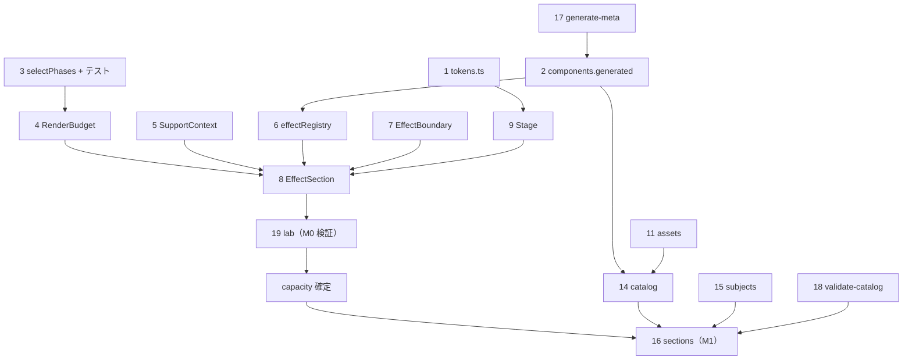

# モジュール仕様書 — 実装のための設計詳細

| | |
|---|---|
| 文書種別 | 実装設計（SDD 補遺 / `design.md` の詳細化） |
| バージョン | 1.1 |
| 作成日 | 2026-07-25 |
| 状態 | レビュー待ち |
| 関連 | [design.md](design.md)（アーキテクチャ） / [ui-design.md](ui-design.md)（ビジュアル） |

**この文書は「そのまま実装に着手できる粒度」を目指す。**
ファイル単位の責務・公開 API・アルゴリズムの厳密仕様・境界条件までを定義する。

---

## 1. モジュール一覧

★ = 他モジュールが依存するため**先に作る必要がある**もの。

| # | ファイル | 責務 | 依存 | 要件 |
|---|---|---|---|---|
| ★1 | `styles/tokens.ts` | 配色トークン、`rgb01()` | なし | REQ-9 |
| ★2 | `data/components.generated.ts` | 25 種メタ情報（自動生成） | なし | NFR-3.3 |
| ★3 | `core/budget/selectPhases.ts` | **選定アルゴリズム（純関数）** | 型のみ | REQ-4 |
| ★4 | `core/RenderBudget.tsx` | 資源管理 Provider / hook | 3 | REQ-4 |
| ★5 | `core/SupportContext.tsx` | html-in-canvas 対応判定 | なし | REQ-5.8 |
| 6 | `core/effectRegistry.ts` | slug → 動的 import | 2 | ADR-4 |
| 7 | `core/EffectBoundary.tsx` | エラー境界 | 4 | REQ-4.7 |
| ★8 | `core/EffectSection.tsx` | **着脱の単位** | 4,5,6,7 | REQ-4.9 |
| 9 | `core/Stage.tsx` | 固定寸法の描画領域 | 1 | ADR-2 |
| 10 | `core/DebugHud.tsx` | 計測 HUD | 4 | AC-3 |
| 11 | `data/assets.ts` | 素材参照（`AssetSource`） | なし | REQ-7.2 / §15 |
| 12 | `data/categories.ts` | カテゴリ・相性マトリクス | 2 | REQ-3 |
| 13 | `data/combos.ts` | 組み合わせプリセット | 2 | REQ-2 |
| 14 | `data/catalog.ts` | 25 セクションの構成定義 | 2,11 | REQ-1 |
| 15 | `subjects/*.tsx` | 被写体テンプレート 5 種 | 1,11 | REQ-1.5 |
| 16 | `sections/*.tsx` | 各セクション | 8,9,14,15 | REQ-1,2,3,8 |
| 17 | `scripts/generate-component-meta.ts` | メタ情報生成 | なし | ADR-5 |
| 18 | `scripts/validate-catalog.ts` | ビルド時制約検証 | 2,14 | REQ-1.6/1.7 |
| 19 | `lab/*.tsx` | 検証ハーネス | 4,8 | REQ-10 |

---

## 2. `selectPhases` — 選定アルゴリズム【中核】

`design.md` §4.6 の厳密仕様。**純関数として切り出し、DOM なしで全境界条件をテストする**（§13）。

### 2.1 シグネチャ

```ts
export interface SectionObservation {
  id: string;
  /** ビューポート中心からの距離（ビューポート高さ単位）。未測定は Infinity */
  distance: number;
  /** 現在のフェーズ */
  phase: SectionPhase;
}

export interface SelectConfig {
  capacity: number;
  activateDistance: number;   // 既定 1.0
  releaseDistance: number;    // 既定 2.0
  prefetchDistance: number;   // 既定 3.0
  /** 現役ボーナス。振動抑制のための距離割引。既定 0.5 */
  incumbentBonus: number;
}

/** 副作用なし・入力が同じなら出力も同じ */
export function selectPhases(
  observations: readonly SectionObservation[],
  config: SelectConfig,
): Map<string, SectionPhase>;
```

### 2.2 アルゴリズム

```
1. failed のものは failed のまま確定し、以降の処理から除外する（終端状態）

2. 各 obs の実効距離を求める
     isIncumbent = (obs.phase === "active")
     effective   = obs.distance - (isIncumbent ? config.incumbentBonus : 0)

3. 活性候補を集める
     candidates = obs のうち次のいずれかを満たすもの
       (a) distance < activateDistance                     … 新規に入ってきたもの
       (b) isIncumbent かつ distance <= releaseDistance     … ヒステリシス域の現役

4. candidates を次の順で昇順ソート（決定性のため 3 段）
     ① effective 昇順
     ② distance 昇順
     ③ id の辞書順

5. 先頭 min(capacity, candidates.length) 個を "active" とする

6. active にならなかった全 obs について
     distance < prefetchDistance ? "preloading" : "dormant"
```

### 2.3 不変条件（テストで検証する）

| ID | 不変条件 |
|---|---|
| I-1 | 結果の `active` の個数は **常に `capacity` 以下** |
| I-2 | `failed` は他のフェーズに遷移しない |
| I-3 | `distance > releaseDistance` のものは `active` にならない |
| I-4 | 同じ入力からは常に同じ出力（決定性）|
| I-5 | `capacity <= 0` のとき `active` は 0 個 |

### 2.4 境界条件（テストケース）

| # | 状況 | 期待 |
|---|---|---|
| 1 | 候補 0 個 | 全て `dormant` |
| 2 | 候補が `capacity` 未満 | 候補すべて `active` |
| 3 | 候補が `capacity` 超過 | 実効距離が近い順に `capacity` 個 |
| 4 | 現役が `capacity` 個 + 新規が中心に出現 | **現役ボーナスを差し引いてなお近い新規が入り、最遠の現役が落ちる** |
| 5 | `capacity` が実行中に減少（モバイル化 / reduced-motion） | 超過分を最遠から解放 |
| 6 | `distance === Infinity`（未測定） | `dormant` |
| 7 | 全て `failed` | 全て `failed`、`active` は 0 |
| 8 | `distance` が同値で並ぶ | `id` 昇順で決定（決定性） |

> **ケース 4 が本アルゴリズムの要点。** 現役を絶対優先にすると、
> 画面中心の新規セクションが永久に活性化されない（starvation）。
> 距離の割引にとどめることで、安定性と応答性を両立する。

### 2.5 呼び出し側の責務（`RenderBudget.tsx`）

- `IntersectionObserver`（`rootMargin: "300% 0px"`）で候補集合を粗く絞る
- **候補数が `capacity` を超えるときのみ** `getBoundingClientRect()` で距離を測る
- 測距と `selectPhases` の実行は `requestAnimationFrame` で 1 フレーム 1 回に間引く
- 結果の差分のみを各セクションへ通知する（`useSyncExternalStore`）

---

## 3. `RenderBudget.tsx`

### 3.1 公開 API

```ts
export const RenderBudgetProvider: React.FC<{
  config?: Partial<BudgetConfig>;
  children: React.ReactNode;
}>;

/** セクションを登録し、自身のフェーズを購読する */
export function useBudgetSlot(id: string): {
  ref: React.RefCallback<HTMLElement>;
  phase: SectionPhase;
  reportFailure: () => void;
};

/** 計測用（DebugHud / AC-3） */
export function useBudgetSnapshot(): BudgetSnapshot;
```

`useBudgetSlot` が登録・購読・解除を 1 つにまとめる。
**セクション側は `ref` を付けて `phase` を見るだけでよい。**

### 3.2 実効 capacity の決定

```
base     = isMobile ? config.capacityMobile : config.capacity
reduced  = prefersReducedMotion ? ceil(base / 2) : base
effective = max(1, reduced)
```
`isMobile` は `matchMedia("(max-width: 639px)")`。
両メディアクエリの変更を購読し、変化時に再選定する（ケース 5）。

---

## 4. `EffectSection.tsx`

### 4.1 レンダリング判定

```
family = componentMeta[effect].family

shouldApply =
  phase === "active"
  && !disabled
  && (family === "object" || supported)   // Object 系は対応判定を無視（REQ-5.7）
```

### 4.2 構造

```tsx
<section ref={ref} data-phase={phase}>
  <LabelRow index={n} total={25} name={...} badges={...} phase={phase} />
  {shouldApply ? (
    <EffectBoundary onError={reportFailure} fallback={<Stage>{children}</Stage>}>
      <LazyEffect slug={effect} {...effectProps}>
        <Stage>{children}</Stage>
      </LazyEffect>
    </EffectBoundary>
  ) : (
    <Stage>{children}</Stage>
  )}
  <Caption>{description}</Caption>
</section>
```

**`<Stage>` が両分岐で同一**であることが `design.md` G-2 の実装上の担保。
レビュー時はここを最初に確認する。

### 4.3 描画開始のウォッチドッグ（REQ-4.7）

```
active になってから 1500ms 以内に、ラッパー内の canvas 要素が
  clientWidth > 0 && clientHeight > 0
を満たさない場合 → reportFailure() を呼ぶ
```
検出後は `failed` となり、以後 `selectPhases` の対象外（I-2）。

> ⚠️ **実装時の修正（2026-07-26）**
> 当初は「出力キャンバス（`canvas[aria-hidden]`）」を探す仕様だったが、これは誤りだった。
> **Object 系（three.js）の canvas に `aria-hidden` は付かない**ため、
> 正常に描画していても 3 種すべてが必ず失敗と判定される。
> セレクタは `canvas`（任意の canvas）とする。
>
> あわせて判定の意味も限定した。WebGL 初期化に失敗した場合は
> Canvas UI 側が自前で素の HTML にフォールバックし、内容は読める。
> `failed` は終端状態で復帰できない（I-2）ため、**判定は保守的に行う**。

### 4.4 Object 系には style で寸法を渡す

```tsx
<Effect {...effectProps} style={{ width: "100%", height: "100%" }} />
```

**ADR-2 と同じ理屈が Object 系にも要る。**
Object 系のルート div は `position: relative` で、中身は絶対配置の canvas のみ。
寸法を与えないと div が高さ 0 に潰れ、canvas も 0px になって何も表示されない。
（実装時に発覚。Hero が描画されない原因だった）

### 4.5 Object 系の差異

- `children` を渡さない。エフェクトは自己完結
- `children` は**エフェクトの外側**（説明文）として描画する
- `onLoad` / `onError` を購読し、読み込み中表示・失敗表示を出す（REQ-7.3 / 7.4）

---

## 5. `Stage.tsx`

```ts
export type StagePreset = "full" | "hero" | "card" | "tall" | "square";

export interface StageProps {
  preset: StagePreset;
  children: React.ReactNode;
}
```

| preset | 実装 |
|---|---|
| `full` | `height: 100vh`（モバイル `80vh`） |
| `hero` | `height: min(80vh, 720px)` |
| `card` | `height: 480px`（モバイル `360px`） |
| `tall` | `height: 160vh` |
| `square` | `aspect-ratio: 1/1; max-width: 560px` |

**必須スタイル**（ADR-2 / `ui-design.md` §5.2）:
```css
position: relative;
overflow: hidden;          /* エフェクトのはみ出し対策。必須 */
border: 1px solid var(--border);
border-radius: 12px;
background: var(--surface);
```

---

## 6. `SupportContext.tsx`

```ts
export function detectHtmlInCanvas(): boolean;   // design.md §6.1 の判定式
export const SupportProvider: React.FC<{ children: React.ReactNode }>;
export function useHtmlInCanvasSupport(): boolean;
```

判定は**アプリ起動時に 1 回のみ**実行し、以後は再評価しない。
Origin Trial の有無・失効はこの判定に自然に反映される（REQ-5.9）。

---

## 7. `effectRegistry.ts`

```ts
type EffectLoader = () => Promise<{ default: React.ComponentType<never> }>;
export const effectRegistry: Record<string, EffectLoader>;
export function preloadEffect(slug: string): void;   // preloading フェーズで呼ぶ
```

**静的な `import()` 文で列挙する**（動的パス結合を使わない）。
Vite がチャンク分割できるのは解析可能な形のみのため。

```ts
export const effectRegistry = {
  glass: () => import("@/components/canvasui/Glass"),
  liquid: () => import("@/components/canvasui/Liquid"),
  // … 25 種を明示列挙
};
```

同一 slug への重複呼び出しは Promise をキャッシュして 1 回に抑える。

---

## 8. `data/assets.ts`（M4 対応の前提 / `design.md` §15.5-1）

```ts
export type AssetSource =
  | { kind: "static";   src: string; label: string }
  | { kind: "uploaded"; src: string; label: string; revoke: () => void };

export const assets = {
  glassObject:    { kind: "static", src: "/svg/logo-outlined.svg",  label: "ロゴ" },
  particleObject: { kind: "static", src: "/images/character-sm.png", label: "キャラクター" },
  ditheredObject: { kind: "static", src: "/models/form.glb",         label: "3D モデル" },
  lensSubject:    { kind: "static", src: "/images/spec-sheet.png",   label: "設定資料" },
} as const satisfies Record<string, AssetSource>;
```

**Object 系セクションは `AssetSource` を受け取り、`kind` を判定せず `src` のみ使う。**
これにより M4 で `kind: "uploaded"` を注入するだけで済む。

---

## 9. `data/catalog.ts`

```ts
export interface CatalogEntry {
  slug: string;
  subject: SubjectKind;
  stage: StagePreset;
  effectProps: Record<string, unknown>;
}

export const catalog: readonly CatalogEntry[];   // 25 件。順序 = 表示順
```

初期値は `ui-design.md` §9 の表をそのまま移す。
色は `rgb01(tokens.x)` の呼び出しで記述し、**数値をハードコードしない**（REQ-9.1）。

---

## 10. `scripts/generate-component-meta.ts`（ADR-5）

| 項目 | 仕様 |
|---|---|
| 入力 | `data/registry.json`（150 items）、`data/options.json` |
| 出力 | `src/data/components.generated.ts` |
| 実行 | `npm run gen:meta`。生成物は**コミットする**（ビルド時にネットワーク非依存） |
| 冒頭 | `// AUTO-GENERATED — DO NOT EDIT. Run: npm run gen:meta` |

導出規則:
```
slug          = name から "-react" を除いた値
family        = dependencies に "three" を含む → "object" / それ以外 → "wrapper"
requiresThree = family === "object"
requiresAsset = family === "object"
acceptsChildren = family === "wrapper"
optionCount   = options.json の要素数
installCommand= `npx shadcn@latest add @canvas-ui/${slug}-react`
docsUrl       = `https://canvasui.dev/docs/components/${slug}`
interaction   = 手動マッピング表（docs/03 §3 に基づく。生成物にインラインで保持）
```

`interaction` のみ自動導出できないため、スクリプト内に定数表として持つ。
**25 件すべてに値があることをスクリプトが検証**し、欠けていれば失敗する。

---

## 11. `scripts/validate-catalog.ts`（REQ-1.6 / 1.7）

ビルド前に実行し、違反があれば**非ゼロ終了してビルドを止める**。

| 検証 | 内容 | 根拠 |
|---|---|---|
| V-1 | `catalog` の要素数が 25 であること | REQ-1.1 |
| V-2 | `componentMeta` の全 slug が過不足なく登場すること | REQ-1.1 |
| V-3 | 同一 `interaction` が **3 連続しない**こと | REQ-1.7 |
| V-4 | `interaction === "scroll"` の 3 件が**連続しない**こと | REQ-1.6 |
| V-5 | `effectProps` のキーが `options.json` に実在すること | 誤記防止 |
| V-6 | Object 系 3 件の `src` が `assets` 経由であること | REQ-7.2 |

> **V-5 は特に有効。** 25 種 × 409 オプションのプロパティ名は取り違えやすく、
> 型では検出できない（`Record<string, unknown>` のため）。

**V-3 は現在の `ui-design.md` §9 の並び順で違反する**（レンズ系 5 連続）。
実装時に並び替えて解消すること（`ui-design.md` U-3）。

---

## 12. 実装順序と依存



### 12.1 段階との対応

| 段階 | 作るもの |
|---|---|
| **M0** | 1, 2, 3, 4, 5, 6, 7, 8, 9, 17, 19 → **検証 T-6 / T-3 を実施し `capacity` を確定** |
| **M1** | 10, 11, 12, 14, 15, 16, 18 → カタログ 25 セクション |
| **M2** | 13 + 組み合わせラボ・相性マトリクス |
| **M3** | 導入案内・SEO |
| **M4** | アップロード（`design.md` §15） |

**M0 で共通基盤をすべて作り切る**のが要点。
検証ハーネス（19）は本番と同じ `RenderBudget` / `EffectSection` を使うため、
M0 の検証がそのまま M1 の土台の動作確認になる。

---

## 13. テスト仕様

| 対象 | 種別 | 内容 |
|---|---|---|
| `selectPhases` | 単体（Vitest） | §2.3 の不変条件 5 件 + §2.4 の境界条件 8 件 |
| `rgb01` | 単体 | 既知値（`#FFFFFF → [1,1,1]`、`#000000 → [0,0,0]`、§2.3 の実測値） |
| `validate-catalog` | 単体 | V-1〜V-6 が違反を検出できること |
| `generate-component-meta` | 単体 | 25 件生成・`interaction` 欠落検出 |
| `EffectSection` | 結合 | 活性/非活性で `<Stage>` の寸法が不変であること（NFR-1.4） |
| マウント往復 | 手動（lab） | T-7 |
| 予算上限 | 手動（lab + DebugHud） | T-6 / AC-3 |
| 受入 | 手動 | AC-1〜10 |

**`selectPhases` の単体テストが品質の中心。** ここが正しければ AC-1〜3 は構造的に満たされる。

---

## 14. 実装上の注意

| # | 注意点 | 理由 |
|---|---|---|
| N-1 | `components/canvasui/` を**編集しない** | G-4 / NFR-3.2。更新時に再取得できなくなる |
| N-2 | セクションのコンテンツを**ステートレス**に保つ | ADR-1。再マウントで状態が失われる |
| N-3 | 色の数値を直接書かない。必ず `rgb01(tokens.x)` | REQ-9.1 |
| N-4 | `"auto"` 系オプションを使わない | REQ-9.4 / T-5 |
| N-5 | 組み合わせ切替は**2 フレームに分ける** | `design.md` §8.2。同一フレームだと両方が一時存在し予算超過 |
| N-6 | `effectRegistry` は静的 `import()` で列挙 | Vite のチャンク分割の制約 |
| N-7 | 初回インストール後、実際の配置先を確認する | レジストリの `target` はルート基準。Vite + src 構成でずれうる |
| N-8 | Draco デコーダを自前ホストに向ける | 外部 CDN 依存の削減 |

---

## 15. 改訂履歴

| 版 | 日付 | 内容 |
|---|---|---|
| 1.0 | 2026-07-25 | 初版。`design.md` 1.1 の詳細化 |
| 1.1 | 2026-07-26 | 実装で判明した §4.3 のセレクタ誤りと §4.4（Object 系の寸法）を反映 |
