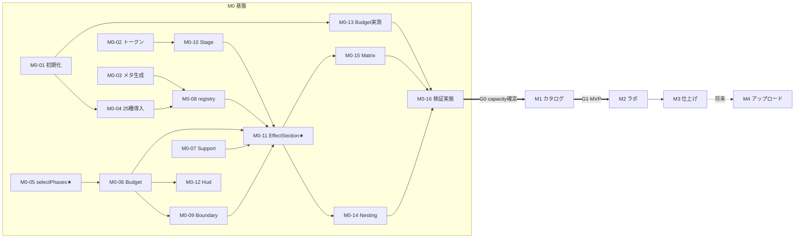

# 実装計画書 — Canvas UI 全機能 LP

| | |
|---|---|
| 文書種別 | 実装タスク（SDD フェーズ 3 / 3） |
| バージョン | 1.0 |
| 作成日 | 2026-07-25 |
| 状態 | レビュー待ち |
| 前工程 | [requirements.md](requirements.md) / [design.md](design.md) / [ui-design.md](ui-design.md) / [module-spec.md](module-spec.md) |

タスク ID は**段階接頭辞**（`M0-01` 等）。検証項目の `T-1〜T-9` とは別体系。

---

## 0. 全体像

| 段階 | 内容 | タスク数 | 規模 | ゲート |
|---|---|---|---|---|
| **M0** | 共通基盤 + 検証ハーネス | 16 | L | **G0**: `capacity` 確定 / T-3 可否確定 |
| **M1** | カタログ 25 セクション（**MVP**） | 13 | L | **G1**: AC-1〜5, 8〜10 合格 |
| **M2** | 組み合わせラボ + 相性マトリクス | 6 | M | **G2**: AC-6 合格 |
| **M3** | 導入案内・SEO・仕上げ | 4 | S | **G3**: NFR-1 / NFR-5 充足 |
| **M4** | 素材アップロード（将来） | 6 | M | — |

**M0 を飛ばして M1 に着手してはいけない。** `capacity` が未確定のままカタログを作ると、
コンテキストロストが発生した際に 25 セクション分の作り直しになる。

### 0.1 共通の完了条件（全タスク）
- `tsc --strict` がエラーなく通る
- `module-spec.md` §14 の注意点 N-1〜N-8 に違反しない
- 新規モジュールは `module-spec.md` の契約どおりの公開 API を持つ

### 0.2 素材の未確定について
素材は別途調達中だが、**M1 の大半は素材なしで進められる**。
`assets.ts` の抽象（`AssetSource`）により、プレースホルダで実装し後から差し替えられる。
**素材確定が必須なのは `M1-11`（Object 系 3 セクション）のみ。**

---

## 1. M0 — 共通基盤 + 検証【最優先】

### M0-01 プロジェクト初期化
- **依存**: なし / **規模**: S
- **作業**: `npm install`。`vite.config.ts` を multi-page 化（`index.html` / `lab.html`）。`globals.css` 作成
- **完了条件**: `npm run dev` で両エントリが表示される。`npm run build` が通る

### M0-02 カラートークン
- **要件**: REQ-9.1 / 9.2 ・ **依存**: なし / **規模**: S
- **作業**: `styles/tokens.ts`（`ui-design.md` §2.1 の値）。`rgb01()` 実装。CSS 変数を同一定義から生成
- **完了条件**: 単体テストが通る（`#FFFFFF→[1,1,1]` / `#000000→[0,0,0]` / §2.3 の実測値 7 件）

### M0-03 メタ情報生成スクリプト
- **要件**: NFR-3.3 / ADR-5 ・ **依存**: なし / **規模**: M
- **作業**: `scripts/generate-component-meta.ts`（`module-spec.md` §10）。`npm run gen:meta` を追加
- **完了条件**: 25 件生成。`interaction` 欠落時に非ゼロ終了する。生成物をコミット

### M0-04 Canvas UI コンポーネント 25 種の導入
- **依存**: M0-01 / **規模**: M
- **作業**: `npx shadcn@latest add @canvas-ui/<slug>-react` を 25 回。**まず 1 本入れて配置先を確認**（N-7）
- **完了条件**: `components/canvasui/` に 25 ファイル。`three` / `@types/three` が入っている。**ソースは未編集**（N-1）
- **注意**: 配置先がずれる場合は `components.json` の aliases か import パスを調整。**コンポーネント本体は触らない**

### M0-05 selectPhases（純関数）＋ 単体テスト【中核】
- **要件**: REQ-4 ・ **依存**: なし / **規模**: M
- **作業**: `core/budget/selectPhases.ts`（`module-spec.md` §2.2 のアルゴリズム）
- **完了条件**: **不変条件 I-1〜I-5 と境界条件 8 件のテストが全て通る**。特にケース 4（starvation 回避）
- **備考**: **このタスクの品質が LP 全体の安定性を決める。** 先にテストを書いてよい

### M0-06 RenderBudget
- **要件**: REQ-4.1〜4.5 ・ **依存**: M0-05 / **規模**: M
- **作業**: `core/RenderBudget.tsx`。IO 粗絞り + rAF 間引き測距 + `useBudgetSlot` / `useBudgetSnapshot`
- **完了条件**: 実効 capacity がモバイル・reduced-motion で切り替わる（`module-spec.md` §3.2）

### M0-07 SupportContext
- **要件**: REQ-5.8 ・ **依存**: なし / **規模**: S
- **完了条件**: 対応環境で `true`、非対応で `false`。起動時 1 回のみ評価

### M0-08 effectRegistry
- **要件**: ADR-4 ・ **依存**: M0-03, M0-04 / **規模**: S
- **作業**: 25 種を**静的 `import()` で明示列挙**（N-6）。`preloadEffect` の重複抑制
- **完了条件**: `npm run build` で 25 チャンクに分割される

### M0-09 EffectBoundary
- **要件**: REQ-4.7 ・ **依存**: M0-06 / **規模**: S
- **完了条件**: 意図的に例外を投げるダミーで、フォールバック表示 + `reportFailure` を確認

### M0-10 Stage
- **要件**: ADR-2 ・ **依存**: M0-02 / **規模**: S
- **作業**: 5 プリセット（`module-spec.md` §5）。`overflow: hidden` 必須
- **完了条件**: 各プリセットの寸法が仕様どおり。モバイル時の縮小が効く

### M0-11 EffectSection【中核】
- **要件**: REQ-4.9 / 5.1 / 5.7 ・ **依存**: M0-06〜M0-10 / **規模**: L
- **作業**: `module-spec.md` §4。判定・構造・ウォッチドッグ・Object 系の差異
- **完了条件**:
  - `<Stage>` が両分岐で同一であること（**レビュー必須項目**）
  - 活性/非活性の切替でステージ寸法が変化しない（NFR-1.4）
  - Object 系が非対応環境でも活性化される（REQ-5.7）

### M0-12 DebugHud
- **要件**: AC-3 ・ **依存**: M0-06 / **規模**: S
- **完了条件**: `?debug=1` で活性数・上限・各フェーズ・概算 fps が表示される

### M0-13 検証ハーネス: ContextBudgetProbe（T-6）
- **要件**: REQ-10.3 ・ **依存**: M0-01 / **規模**: M
- **作業**: `module-spec.md` 準拠。WebGL2 コンテキストを逐次生成し実測上限を測る
- **完了条件**: 実測上限が数値で表示される

### M0-14 検証ハーネス: NestingProbe（T-2 / T-3 / T-4）
- **要件**: REQ-10.4 ・ **依存**: M0-11 / **規模**: M
- **作業**: 外側・内側の組を選択、段数 1〜3 切替、fps 常時表示
- **完了条件**: 任意の 2 種の入れ子と、Object 系の内包を試せる

### M0-15 検証ハーネス: MatrixProbe（T-5 / T-7）
- **依存**: M0-11 / **規模**: S
- **作業**: `"auto"` と RGB 明示の比較。マウント／アンマウントの反復
- **完了条件**: 往復 50 回で描画が復帰し続けることを確認できる

### M0-16 検証の実施と記録【ゲート】
- **要件**: REQ-10.5 ・ **依存**: M0-13〜M0-15 / **規模**: M
- **作業**: Chrome Canary 149+ / `#canvas-draw-element` 有効で **T-1〜T-9 を実施**
- **完了条件**:
  - `docs/03-combination-research.md` §7 の表に**実測結果を記入**
  - `BudgetConfig.capacity` を確定（実測値の 50〜60%）→ D-1 解消
  - T-3 の可否を確定 → D-2 解消、`combos.ts` の `gatedBy` 方針決定
  - T-2 不成立なら REQ-2.3 を「並置」に読み替え（REQ-10.6）

---

> ### 🚩 ゲート G0
> **`capacity` が数値で確定していること。T-3 の可否が判明していること。**
> ここが未達のまま M1 に進まない。

---

## 2. M1 — カタログ 25 セクション【MVP】

### M1-01 素材参照の定義
- **要件**: REQ-7.2 / §15.5-1 ・ **依存**: なし / **規模**: S
- **作業**: `data/assets.ts`。**`AssetSource` を判別可能ユニオンで定義**（M4 の前提）
- **完了条件**: Object 系がパスを直接持たない。プレースホルダで動く

### M1-02 被写体テンプレート 5 種
- **要件**: REQ-1.5 / 6.8 ・ **依存**: M0-02 / **規模**: L
- **作業**: `subjects/` に `dense-document` / `bold-heading` / `color-artwork` / `ui-mock` / `object-stage`（`ui-design.md` §8）
- **完了条件**: `alt` を型として要求する。`ui-mock` は背景色を明示指定（`"auto"` 不使用）

### M1-03 カタログ定義
- **要件**: REQ-1.1 / 1.3 ・ **依存**: M0-03, M1-01 / **規模**: M
- **作業**: `data/catalog.ts` に 25 件（`ui-design.md` §9 の表）。色は `rgb01(tokens.x)` で記述（N-3）
- **完了条件**: 25 件。数値のハードコードなし

### M1-04 並び順の是正
- **要件**: REQ-1.6 / 1.7 ・ **依存**: M1-03 / **規模**: S
- **作業**: レンズ系 5 連続を解消（`ui-design.md` U-3）。スクロール駆動 3 種を分離
- **完了条件**: M1-05 の V-3 / V-4 が通る

### M1-05 ビルド時検証スクリプト
- **要件**: REQ-1.6 / 1.7 ・ **依存**: M1-03 / **規模**: M
- **作業**: `scripts/validate-catalog.ts`（V-1〜V-6）。`npm run build` の前段に組み込む
- **完了条件**: 違反を意図的に作ると**ビルドが止まる**。特に V-5（プロパティ名の実在確認）

### M1-06 対応バナー
- **要件**: REQ-5.3〜5.6 ・ **依存**: M0-07 / **規模**: S
- **完了条件**: 非対応時のみ表示。閉じると `sessionStorage` に保持。`position: fixed` でない

### M1-07 カタログセクション
- **要件**: REQ-1.1〜1.4 ・ **依存**: M0-11, M1-02〜M1-05 / **規模**: L
- **作業**: `sections/Catalog.tsx`。`catalog` を map して `EffectSection` を並べる
- **完了条件**: 25 セクションが表示。ラベル行に連番・カテゴリバッジ・導入コマンド

### M1-08 Hero
- **要件**: REQ-1 ・ **依存**: M0-11, M1-01 / **規模**: M
- **作業**: `GlassObject` + display 見出し（`ui-design.md` §7）
- **完了条件**: **非対応ブラウザでも 3D が動く**（REQ-5.7 の実地確認）

### M1-09 仕組みの解説セクション
- **依存**: M0-11 / **規模**: S
- **作業**: `Glass` で解説文自体を被写体にする

### M1-10 制約と限界セクション
- **要件**: REQ-3.4 / 3.5 ・ **依存**: M0-02 / **規模**: M
- **作業**: コンテキスト予算とブラウザ対応の図解。エフェクトなし
- **完了条件**: M0-16 の**実測値を反映**する

### M1-11 Object 系 3 セクションの素材差し替え
- **要件**: REQ-7 ・ **依存**: M1-01, **素材確定** / **規模**: S
- **作業**: 実素材を配置し `assets.ts` を更新。`ParticleObject.count` を実素材に合わせ再調整（U-4）
- **完了条件**: 3 種が実素材で描画。読み込み失敗時に代替表示（REQ-7.3）
- **ブロッカー**: 素材の到着待ち。**他タスクは待たずに進める**

### M1-12 レスポンシブとフッター
- **要件**: NFR-2.3 / 2.4 ・ **依存**: M1-07 / **規模**: M
- **作業**: `ui-design.md` §10。モバイルで上限 3、`full` を 80vh
- **完了条件**: 375px 幅で内容が読める

### M1-13 MVP 受入試験【ゲート】
- **要件**: AC-1〜5, 8〜10 ・ **依存**: M1-01〜M1-12 / **規模**: M
- **作業**: 受入シナリオを実施し結果を記録
- **完了条件**:
  - AC-1 / AC-2: 上下双方向の通しスクロールで**黒画面ゼロ**
  - AC-3: DebugHud で活性数が常に上限以下
  - AC-4 / AC-10: Safari と OT 無効で内容が読める + バナー表示
  - AC-5: reduced-motion で読める
  - AC-8: モバイル実機で読める / AC-9: キーボード走査

---

> ### 🚩 ゲート G1 — MVP 完成
> **AC-1〜5, 8〜10 が全て合格していること。**

---

## 3. M2 — 組み合わせラボ + 相性マトリクス

### M2-01 カテゴリと相性マトリクスのデータ
- **要件**: REQ-3.1〜3.3 ・ **依存**: M0-16 / **規模**: M
- **作業**: `data/categories.ts`。**`verifiedBy` に M0-16 の実測 ID を入れる。未検証は `null`**
- **完了条件**: 推測のみのセルが `null` になっている（REQ-3.3）

### M2-02 組み合わせプリセット
- **要件**: REQ-2.3 / 2.6〜2.9 ・ **依存**: M0-16 / **規模**: M
- **作業**: `data/combos.ts`。showcase 4 件 + antipattern 2 件。T-3 依存分に `gatedBy`
- **完了条件**: 入れ子 2 段以下。色は RGB 明示（N-4）

### M2-03 パラメータ融合サブセクション
- **要件**: REQ-2.1 / 2.2 ・ **依存**: M0-11 / **規模**: M
- **作業**: `Glass` 1 つ + スライダー列。props 更新のみで反映（再マウント不要）
- **完了条件**: コンテキスト消費が 1 個であることを DebugHud で確認

### M2-04 入れ子実演サブセクション
- **要件**: REQ-2.4 / 2.5 ・ **依存**: M2-02 / **規模**: L
- **作業**: タブ切替。**切替は 2 フレームに分ける**（N-5）
- **完了条件**: 切替時に前の組が解放される。同時 1 組のみ

### M2-05 相性マトリクスセクション
- **要件**: REQ-3.1 / 3.2 ・ **依存**: M2-01 / **規模**: M
- **完了条件**: 5×5 表。根拠をツールチップ表示。**未検証セルは視覚的に区別**

### M2-06 M2 受入試験【ゲート】
- **要件**: AC-6 ・ **依存**: M2-01〜M2-05 / **規模**: S
- **完了条件**: 全プリセットを順に切り替えて正常描画・正常解放

---

## 4. M3 — 導入案内・仕上げ

### M3-01 導入案内セクション
- **要件**: REQ-8.1〜8.6 ・ **規模**: M
- **完了条件**: CLI / MCP / 手動の 3 手順。コピーボタン動作。ライセンス表記

### M3-02 SEO / OGP
- **要件**: NFR-5 ・ **規模**: S
- **完了条件**: `title` / `description` / OGP。見出しレベルが妥当。`h1` は 1 つ

### M3-03 性能計測と調整
- **要件**: NFR-1 ・ **規模**: M
- **完了条件**: LCP 2.5 秒以内 / CLS 0.1 未満 / 効果セクションで 50fps 以上 / 10 分閲覧でメモリ単調増加なし

### M3-04 Origin Trial トークン適用
- **要件**: REQ-5.9 ・ **規模**: S / **ブロッカー**: **ドメイン確定（Q-1）**
- **作業**: トークンを取得し `index.html` の meta を有効化。**失効日を記録**
- **完了条件**: 本番ドメインでフラグなしにエフェクトが動く

---

## 5. M4 — 素材アップロード（将来）

`design.md` §15 に基づく。**MVP では着手しない。**

| ID | 内容 | 要件 |
|---|---|---|
| M4-01 | 受理判定（形式・サイズ・解像度、GLB マジックバイト確認） | REQ-11.6 / 11.7 |
| M4-02 | `UploadedAsset` とライフサイクル管理（`onLoad` 後に前を解放） | REQ-11.9 |
| M4-03 | アップロード UI（ファイル選択 + D&D + プライバシー明示） | REQ-11.1 / 11.14 |
| M4-04 | Object 系プレイグラウンド（エフェクト切替、素材は保持） | REQ-11.3 / 11.11 / 11.12 |
| M4-05 | Wrapper 系への適用（対応環境のみ） | REQ-11.4 / Q-10 |
| M4-06 | 異常系（読み込み失敗時に原因提示・直前状態を維持） | REQ-11.8 |

**前提**: M1 で `M1-01`（`AssetSource` 抽象）と `M2-04`（切替機構の再利用可能化）が
済んでいること。これらが無いと M4 で作り直しになる。

---

## 6. 依存関係

**クリティカルパス**: `M0-05 → M0-06 → M0-11 → M0-14 → M0-16 → G0 → M1-07 → G1`

---

## 7. リスクとブロッカー

| # | リスク | 影響 | 対応 |
|---|---|---|---|
| R-1 | **T-6 の実測上限が想定より低い**（例: 4 以下） | カタログの体験が断続的になる | ステージを小さくし 1 画面複数配置をやめる。`prefetchDistance` を縮める |
| R-2 | **T-3 不成立**（Object 系を内包できない） | 目玉が 1 つ減る | 並置（P4）に退避。REQ-2.8 が既に条件付き |
| R-3 | **T-2 不成立**（入れ子が成立しない） | 組み合わせラボの前提が崩れる | REQ-10.6 により「並置による提示」に読み替え。M2 の設計変更 |
| R-4 | 素材の到着遅延 | M1-11 のみ停止 | プレースホルダで進行。他 12 タスクは影響なし |
| R-5 | **ドメイン未確定（Q-1）** | M3-04 が着手不能 | 早期決定を依頼。開発はフラグ運用で進行可 |
| R-6 | Origin Trial の失効 | 公開後に全 22 種が停止 | 失効日を記録し監視。失効してもフォールバックで内容は読める |
| R-7 | Chrome の仕様変更（OT 期間中） | 動作不能 | 影響は Wrapper 系のみ。Object 系 3 種と全文コンテンツは無事 |

**R-1〜R-3 はすべて M0-16 で判明する。** これが M0 を先行させる理由。

---

## 8. 進捗チェックリスト

### M0（16）
- [x] M0-01 初期化 / [x] M0-02 トークン / [x] M0-03 メタ生成 / [x] M0-04 25種導入
- [x] **M0-05 selectPhases ★** / [x] M0-06 RenderBudget / [x] M0-07 Support / [x] M0-08 registry
- [x] M0-09 Boundary / [x] M0-10 Stage / [x] **M0-11 EffectSection ★** / [x] M0-12 Hud
- [x] M0-13 T-6 / [x] M0-14 T-2/3/4 / [x] M0-15 T-5/7 / [ ] **M0-16 検証実施 🚩 ← 対応環境が必要**

> **M0-16 の進捗**（2026-07-26 時点）
> - ✅ **T-6 実測完了**: 同時生存 16 / 推奨 capacity **8**（`DEFAULT_SELECT_CONFIG` の初期値と一致。**未決 D-1 解消**）
> - ✅ T-8 部分確認: 非対応環境で素の HTML・エラーなし
> - ⏳ T-1〜T-5, T-7, T-9: **Chrome Canary 149+ ＋ `#canvas-draw-element` 有効**な環境で実施が必要
> - ⏳ **T-3 未実施のため未決 D-2 は未解消**（`combos.ts` の `gatedBy` 方針は M2 までに決めればよい）

### M1（13）
- [x] M1-01 assets / [x] M1-02 被写体5種 / [x] M1-03 catalog / [x] M1-04 並び順是正
- [x] M1-05 ビルド検証 / [x] M1-06 バナー / [x] M1-07 カタログ / [x] M1-08 Hero
- [x] M1-09 仕組み / [x] M1-10 制約 / [ ] M1-11 素材差替（**素材待ち**） / [x] M1-12 レスポンシブ
- [x] **M1-13 MVP 受入 🚩** — AC-1,2,3,6,8,9,10 合格 / AC-5(T-9) と AC-4(Safari) が残り

### M2（6）
- [x] M2-01 マトリクスデータ / [x] M2-02 プリセット / [x] M2-03 パラメータ融合
- [x] M2-04 実演（**入れ子 → 並置＋Object内包に変更**） / [x] M2-05 マトリクス / [ ] **M2-06 受入 🚩**

> **T-2 不成立を受けた設計変更**（design.md §8.2 改訂）
> - 「入れ子実演」を廃止し、**重ねる（Object×Wrapper）/ 並べる / 重ねられない（実証）** の 3 種に再構成
> - マトリクスを 2 段構えに: **構造的可否（実測・実線）** と **並置の相性（設計指針・破線）**
> - REQ-2.7（入れ子 2 段以下）は失効、REQ-2.8 は成立を確認して採用

### M3（4）
- [x] M3-01 導入案内 / [x] M3-02 SEO / [x] M3-03 性能 / [ ] M3-04 OT トークン（**ドメイン未確定 Q-1**）

> **M3 実測**: LCP 140ms / CLS 0.000 / 最低 fps 94 / 初期ロード 249KB / 29 チャンク。
> PT-01〜03, 05, 06 すべて合格。

---

## 9. 改訂履歴

| 版 | 日付 | 内容 |
|---|---|---|
| 1.0 | 2026-07-25 | 初版。全 39 タスク（M0:16 / M1:13 / M2:6 / M3:4）＋ M4 の 6 件 |
